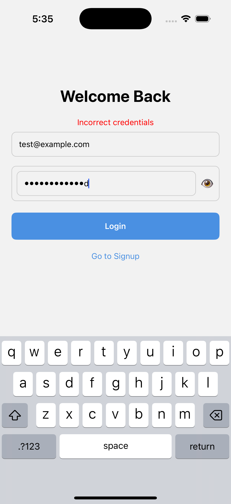
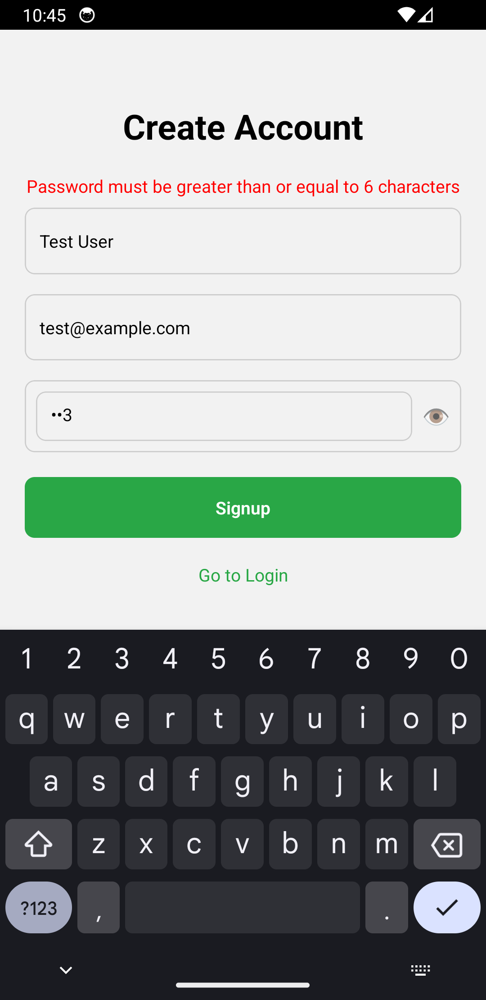

# AuthApp

A React Native CLI application demonstrating Login & Signup flows using:
- React Context API for auth state
- React Navigation for screen management
- AsyncStorage for persistence
- Animated API for simple screen animations
- Password visibility toggle

## Setup

```bash
git clone <this-repo-url>
cd AuthApp
yarn install
cd ios && pod install && cd ..
npx react-native run-ios   # or run-android
```

## Features


1. Login / Signup with form validation
2. AuthContext providing login, signup, logout, and user state
3. AsyncStorage-backed persistence
4. Screen animations via React Native’s Animated API
5. Password visibility toggle 🕶️

## Bonus features
1. Added Detox for visual testing
2. Automatic screenshots and video generation (FFMPEG Must be installed) while testing using detox. 

### iOS Screenshots

| 01_SignupScreen.png<br> | 02_Signup_Error_Required.png<br> | 03_Signup_Error_InvalidEmail.png<br> | 04_Signup_Error_ShortPassword.png<br> |
|:---:|:---:|:---:|:---:|
| 05_Home_After_Signup.png<br> | 06_Login_After_Logout.png<br> | 07_Login_Error_InvalidEmail.png<br> | 08_Login_Error_WrongCreds.png<br> |
| 09_Home_After_Login.png<br> | 10_Login_Final.png<br> |  |  |

---

#### iOS Flow Preview

<p align="center">
  
</p>

---

### Android Screenshots

| 01_SignupScreen.png<br> | 02_Signup_Error_Required.png<br> | 03_Signup_Error_InvalidEmail.png<br> | 04_Signup_Error_ShortPassword.png<br> |
|:---:|:---:|:---:|:---:|
| 05_Home_After_Signup.png<br> | 06_Login_After_Logout.png<br> | 07_Login_Error_InvalidEmail.png<br> | 08_Login_Error_WrongCreds.png<br> |
| 09_Home_After_Login.png<br> | 10_Login_Final.png<br> |  |  |

---

#### Android Flow Preview

<p align="center">
  
</p>
